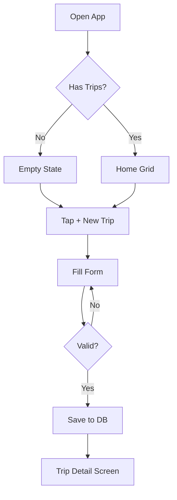
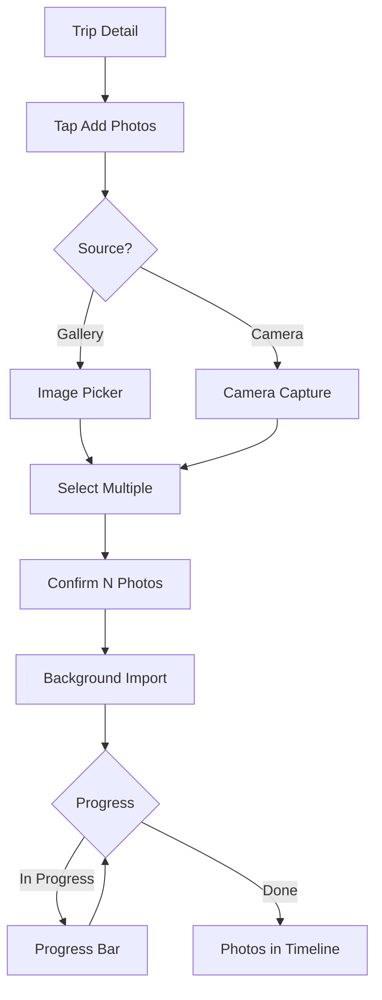
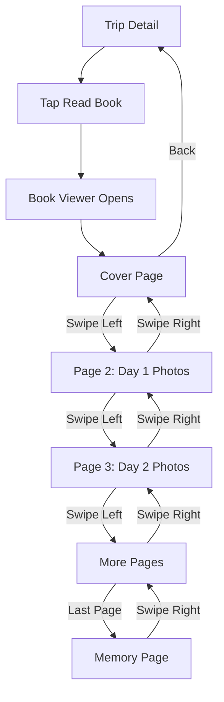
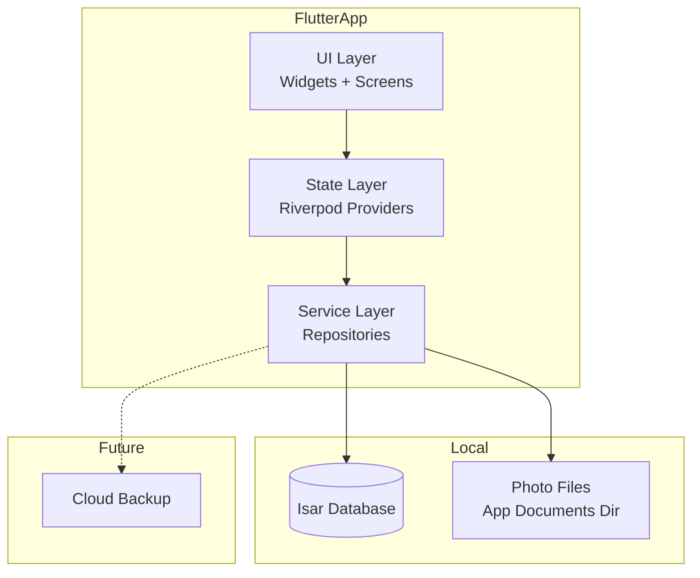

# PRD — Travel Memory Book

Source: `idea.md`, `validate.md`, user spec sections 1–36

---

## Document Info

| Field | Value |
|-------|-------|
| Product Name | Travel Memory Book |
| Slug | travel_memory_book |
| Version | 1.0 |
| Last Updated | 2026-08-29 |
| Status | Draft |
| Owner | Lãm (personal project) |
| Application ID | com.lam.travelmemorybook |

---

## 1. Product Overview

### 1.1 Product Vision

Travel Memory Book là **thư viện ký ức cá nhân** được trình bày dưới dạng những cuốn sách ảnh du lịch. Mỗi chuyến đi là một cuốn sách, mỗi ngày là một chương, mỗi địa điểm là một phần câu chuyện, mỗi bức ảnh là một trang ký ức.

> "Nhiều năm sau, người dùng có thể mở ứng dụng, chọn một chuyến đi cũ và cảm giác như mình đang quay trở lại thời điểm đó."

### 1.2 Target Users

**Primary**: Chính người dùng (Lãm) — cá nhân đi du lịch nhiều, chụp ảnh nhiều, muốn có nơi riêng tư để lưu giữ kỷ niệm.

**Secondary** (tương lai): Bất kỳ ai muốn một cuốn nhật ký du lịch cá nhân mà không có áp lực xã hội (no likes, no comments, no followers).

### 1.3 Business Objectives

- **MVP (Phase 1)**: Một ứng dụng Flutter offline-first, lưu trữ cục bộ, cho phép tạo + xem Travel Books.
- **Phase 2**: Map view, calendar, statistics, search, EXIF, export PDF.
- **Phase 3**: Cloud backup, multi-device sync, AI captions, in thành sách thật.

### 1.4 Success Metrics

| Metric | Target | Measurement |
|--------|--------|-------------|
| Photo import time | < 2s per 10 photos (background) | Import 100 photos mà UI không freeze |
| Travel Book render | < 500ms per page | Smooth page-flip animation ≥ 60fps |
| Local DB query | < 100ms p95 | List view, timeline view |
| Storage efficiency | Original + thumbnail only (no full copy) | Mỗi ảnh chỉ 2 file (original + thumb) |
| Crash-free rate | ≥ 99% | Trên 1,000 session đầu tiên |
| Offline capability | 100% features work without network | All MVP features work on airplane mode |

---

## 2. User Personas

### Persona 1: Lãm — The Personal User

- **Demographics**: 25-35 tuổi, developer, đi du lịch 3-5 chuyến/năm
- **Goals**: Lưu giữ kỷ niệm du lịch theo cách có tổ chức, đẹp mắt, riêng tư
- **Pain Points**: Google Photos quá generic, Instagram thì social, journaling apps thì không có ảnh
- **User Journey**: Đi du lịch → chụp ảnh → về nhà → mở app → tạo trip → add photos → viết memory → đọc lại sau
- **Quote**: *"Tôi muốn mở app và thấy những cuốn sách đẹp như những cuốn photo album thật, không phải feed Instagram."*

### Persona 2: Wanderlust Memory Keeper

- **Demographics**: 30-45 tuổi, thích du lịch, thích viết nhật ký
- **Goals**: Kết hợp ảnh + ghi chú + cảm xúc thành một cuốn sách kỷ niệm có thể in ra
- **Pain Points**: Mất ảnh, không nhớ chi tiết chuyến đi sau vài năm
- **User Journey**: Sau chuyến đi → import ảnh → gắn GPS + caption → viết daily journal → mở lại mỗi năm
- **Quote**: *"Sau 5 năm tôi muốn mở lại và cảm giác như đang quay lại thời điểm đó."*

---

## 3. Feature Requirements

### 3.1 Feature Matrix

| ID | Feature | Description | Priority | Acceptance Criteria | Dependencies |
|----|---------|-------------|----------|---------------------|--------------|
| F1 | Home — Travel Books Library | List các Travel Books đã tạo | Must | Given user has trips, When opens app, Then see list sorted by date | DB, Trip model |
| F2 | Create Trip | Form tạo chuyến đi mới | Must | Given user on home, When taps "+", Then can fill name/location/dates/cover | Image picker, DB |
| F3 | Add Photos | Multi-select photos từ gallery/camera | Must | Given user in trip, When taps "Add Photos", Then can select N photos and import | image_picker, EXIF |
| F4 | Photo Timeline | Auto-sort ảnh theo ngày | Must | Given photos imported, When views timeline, Then photos grouped by day | DB, sort logic |
| F5 | Travel Book | Auto-assemble ảnh thành cuốn sách | Must | Given trip has photos, When opens book, Then see cover + pages | DB, Book model |
| F6 | Book Viewer | Lật trang sách như cuốn album thật | Must | Given user opens book, When swipes, Then page flips with animation | PageView, animation |
| F7 | Memory / Journal | Viết ghi chú cho trip/day/photo | Must | Given user in trip, When taps "Memory", Then can write notes | DB, Memory model |
| F8 | Photo Detail | Xem ảnh + metadata + caption | Must | Given user in book, When taps photo, Then see full screen + details | Photo model |
| F9 | Local Storage | SQLite/Isar + file system | Must | Given user creates trip, When app restarts, Then data persists | Isar, path_provider |
| F10 | Dark/Light Mode | Theme switching | Should | Given any screen, When toggles theme, Then UI adapts | Theme system |
| F11 | EXIF Read | Auto-extract date, GPS, camera | Should | Given photo has EXIF, When imported, Then metadata auto-filled | exif package |
| F12 | Trip Sorting | Sort by date/year/country | Should | Given multiple trips, When changes sort, Then list reorders | DB query |
| F13 | Cover Photo | Set custom cover for trip | Should | Given user creating trip, When picks cover, Then it shows on book | Image picker |
| F14 | Map View | Hiển thị places lên bản đồ | Could | Given trip has GPS, When views map, Then pins on map | flutter_map |
| F15 | Calendar View | Lịch trip theo ngày | Could | Given trips, When opens calendar, Then dots on trip days | Custom calendar |
| F16 | Statistics | Đếm trips/cities/photos | Could | Given user has data, When views stats, Then see numbers | DB aggregations |
| F17 | Search | Tìm trong memory/photos | Could | Given user has data, When searches, Then matching results | Full-text search |
| F18 | Export PDF | Export Travel Book ra PDF | Could | Given trip, When exports, Then PDF generated | pdf package |
| F19 | Cloud Backup | Sync to cloud (Phase 3) | Won't (MVP) | N/A in MVP | Cloud provider |
| F20 | Multi-device Sync | Sync across devices (Phase 3) | Won't (MVP) | N/A in MVP | Cloud sync |

### 3.2 Feature Details

#### F1: Home — Travel Books Library

**Description**: Trang chủ hiển thị danh sách các Travel Books dưới dạng grid/library view.

**User Stories**:
- As a user, I want to see all my travel books on the home screen so I can quickly pick a trip to revisit.
- As a user, I want to see trip stats (photos, places) so I know what's in each book.

**Acceptance Criteria**:
- Given user has 0 trips, When opens home, Then see empty state with "Create your first trip" CTA.
- Given user has trips, When opens home, Then see grid of book cards with cover + name + year + photo count.
- Given user taps a book, When on home, Then navigate to trip detail.

**Edge Cases**:
- 0 trips → empty state
- 100+ trips → scroll/paginate
- Missing cover photo → show placeholder

#### F2: Create Trip

**Description**: Form tạo chuyến đi mới với name, location, dates, description, cover.

**User Stories**:
- As a user, I want to create a new trip with name and location so I can start adding photos.
- As a user, I want to set a cover photo so the book looks beautiful.

**Acceptance Criteria**:
- Given user on home, When taps "+ New Travel Book", Then form opens.
- Given user fills required fields (name, dates), When submits, Then trip is created and saved.
- Given user picks cover photo, When saves, Then cover displays on book card.

**Edge Cases**:
- Empty name → validation error
- End date < start date → validation error
- No cover picked → use first photo as default cover

#### F3: Add Photos

**Description**: Multi-select photos từ gallery hoặc camera, với progress indicator.

**User Stories**:
- As a user, I want to add 50+ photos at once so I can quickly import a trip.
- As a user, I want to see import progress so I know when it's done.

**Acceptance Criteria**:
- Given user in trip detail, When taps "Add Photos", Then image picker opens.
- Given user selects 30 photos, When confirms, Then progress bar shows 0-100%.
- Given import completes, When done, Then photos appear in trip timeline.

**Edge Cases**:
- 100+ photos → background processing, lazy load
- Same photo selected twice → deduplicate by hash
- EXIF missing → show as "Unknown location"

#### F6: Book Viewer

**Description**: Trình xem sách dạng lật trang, giống cuốn album thật.

**User Stories**:
- As a user, I want to flip through pages like a real book so it feels nostalgic.
- As a user, I want to see cover → day 1 → day 2 → ... → memory.

**Acceptance Criteria**:
- Given user on trip detail, When taps "Read Book", Then book viewer opens with cover.
- Given user swipes left, When on cover, Then flips to first day.
- Given user swipes right, When on page 2, Then flips back to cover.
- Given user on memory page, When swipes, Then end-of-book indicator shows.

**Edge Cases**:
- Trip with 0 photos → empty book message
- Trip with 1 photo → cover + 1 page

#### F7: Memory / Journal

**Description**: Cho phép viết ghi chú cho trip, day, photo.

**User Stories**:
- As a user, I want to write a memory for the whole trip so I can remember how I felt.
- As a user, I want to write a daily journal so each day has its own story.

**Acceptance Criteria**:
- Given user in trip, When taps "Memory", Then text editor opens.
- Given user types content, When saves, Then memory persists.
- Given user opens book, When reaches memory page, Then see the text.

**Edge Cases**:
- Empty memory → page skipped
- Very long memory → scrollable, paginated

#### F9: Local Storage (Offline-First)

**Description**: Tất cả data lưu local, app hoạt động không cần internet.

**User Stories**:
- As a user, I want to use the app on airplane mode so I can review trips while traveling.
- As a user, I want my data to persist across app restarts.

**Acceptance Criteria**:
- Given app installed, When user creates trip without network, Then trip is saved locally.
- Given app force-quit, When reopened, Then all data is intact.
- Given user imports photos, When storage fills up, Then show warning.

**Edge Cases**:
- Storage full → graceful error
- DB corruption → try auto-repair, then backup

---

## 4. User Flows

### 4.1 Create Trip Flow

**Description**: User tạo chuyến đi mới từ Home.

**Steps**:
1. User mở app → thấy Home với empty state
2. User tap "+ New Travel Book"
3. Form mở → user điền name, location, dates
4. User pick cover photo (optional)
5. User tap "Create"
6. Trip được lưu vào DB
7. User thấy trip detail screen với empty photos

**Alternative Paths**:
- If name empty → show validation
- If user cancels → return to home without saving

**Error States**:
- DB write fail → show retry



### 4.2 Add Photos Flow

**Description**: User thêm ảnh vào trip.

**Steps**:
1. User ở trip detail
2. Tap "Add Photos"
3. Chọn "Gallery" hoặc "Camera"
4. Multi-select ảnh
5. Confirm selection
6. Background import với progress
7. Photos xuất hiện trong timeline



### 4.3 Read Book Flow

**Description**: User mở và đọc Travel Book.

**Steps**:
1. User ở trip detail
2. Tap "Read Book"
3. Book viewer mở với cover
4. Swipe left → lật trang
5. Mỗi page có ảnh + caption + location
6. Last page → memory
7. Swipe right hoặc back → return



---

## 5. Non-Functional Requirements

### 5.1 Performance

| Requirement | Target | Notes |
|-------------|--------|-------|
| App cold start | < 2s | On mid-range Android |
| Photo import | < 2s per 10 photos | Background isolate |
| Timeline load | < 300ms for 500 photos | Indexed query |
| Book page render | < 100ms | Cached thumbnails |
| Page flip animation | 60fps | No jank |
| DB query p95 | < 100ms | Indexed columns |

### 5.2 Security

- **Local data**: App data is private by default (no network, no sharing)
- **Photo files**: Stored in app-private directory (path_provider getApplicationDocumentsDirectory)
- **No analytics**: No tracking, no telemetry in MVP
- **Future cloud backup**: Encrypted at rest, end-to-end encryption if added

### 5.3 Compatibility

| Platform | Requirement |
|----------|-------------|
| Android | API 21+ (Android 5.0) |
| iOS | iOS 13+ (future) |
| Flutter | 3.x+ stable |
| Screen sizes | 320px - 2560px (phone + tablet) |

### 5.4 Accessibility

- **Contrast**: WCAG AA for text (4.5:1 for normal, 3:1 for large)
- **Touch targets**: Minimum 48x48 dp
- **Screen reader**: Semantic labels on icons
- **Font scaling**: Support system font size (up to 200%)

### 5.5 Storage

- **Local DB**: Isar (NoSQL, fast for this use case)
- **Photo files**: App documents directory
- **Thumbnails**: Generated on import, 512x512
- **Originals**: Stored as-is, not re-compressed

---

## 6. Technical Specifications

### 6.1 System Architecture



### 6.2 Frontend (Flutter)

- **Framework**: Flutter 3.x stable
- **Language**: Dart 3.x
- **State Management**: Riverpod 2.x
- **Navigation**: go_router
- **HTTP** (future): dio
- **Image picker**: image_picker
- **EXIF**: exif package
- **Local DB**: Isar
- **Path**: path_provider
- **Date utils**: intl
- **Map** (Phase 2): flutter_map
- **PDF** (Phase 2): pdf + printing

### 6.3 Backend

- **MVP**: None. Offline-first.
- **Phase 3**: TBD (Firebase / Supabase / custom FastAPI)

### 6.4 Infrastructure

- **Local**: App documents directory
- **Cloud** (Phase 3): TBD
- **CI/CD**: GitHub Actions (pre-commit hooks via devops-pipeline)

### 6.5 Folder Structure

```
lib/
├── main.dart
├── app.dart
├── core/
│   ├── theme/
│   ├── router/
│   ├── constants/
│   ├── database/         # Isar setup
│   └── utils/            # EXIF, image utils
├── features/
│   ├── home/             # Library view
│   ├── trips/            # Trip CRUD
│   ├── travel_book/      # Book generation + viewer
│   ├── memories/         # Journal
│   ├── photos/           # Photo detail, import
│   ├── map/              # Phase 2
│   ├── profile/          # Personal stats
│   └── settings/         # Theme, backup
├── models/               # Data models
│   ├── trip.dart
│   ├── photo.dart
│   ├── memory.dart
│   ├── location.dart
│   └── travel_book.dart
└── repositories/         # Data access layer
```

---

## 7. Analytics & Monitoring

### 7.1 Key Metrics (Personal Use)

| Category | Metric | Description | Target |
|----------|--------|-------------|--------|
| Engagement | Trips created | Total trips in app | Personal count |
| Engagement | Photos imported | Total photos | Personal count |
| Engagement | Book views | How often user reads old books | Personal |
| Tech | Crash-free rate | Sessions without crash | ≥ 99% |
| Tech | ANR rate | App not responding | < 0.1% |

### 7.2 Events to Track (Future, opt-in)

| Event | Trigger | Properties |
|-------|---------|------------|
| trip_created | User creates trip | trip_id, has_cover |
| photo_imported | User imports photos | count, source |
| book_viewed | User reads a book | trip_id |
| memory_written | User writes memory | trip_id, char_count |

### 7.3 Privacy

- **MVP**: Zero analytics, zero telemetry
- **Future**: All analytics opt-in, anonymized, no third-party

---

## 8. Release Planning

### 8.1 MVP (v1.0)

**Target**: Phase 1 complete

**Core Features**:
- [x] F1: Home — Travel Books Library
- [x] F2: Create Trip
- [x] F3: Add Photos (gallery + camera)
- [x] F4: Photo Timeline
- [x] F5: Travel Book assembly
- [x] F6: Book Viewer
- [x] F7: Memory / Journal
- [x] F8: Photo Detail
- [x] F9: Local Storage (Isar)
- [x] F10: Dark/Light Mode
- [x] F11: EXIF Read
- [x] F12: Trip Sorting
- [x] F13: Cover Photo

**Success Criteria**:
- Can create trip, add 50+ photos, view book, write memory
- All data persists across restarts
- App works fully offline
- No crashes in 10-trip test session

**Launch Checklist**:
- [ ] All Must + Should features done
- [ ] flutter analyze clean (0 errors)
- [ ] Basic tests pass
- [ ] App builds for Android release
- [ ] Store metadata prepared
- [ ] Compliance check passes

### 8.2 Version 1.1 (Phase 2)

**Timeline**: After MVP stable

**Features**:
- [ ] F14: Map View
- [ ] F15: Calendar View
- [ ] F16: Statistics
- [ ] F17: Search
- [ ] F18: Export PDF

### 8.3 Version 2.0 (Phase 3)

**Timeline**: Long term

**Features**:
- [ ] F19: Cloud Backup
- [ ] F20: Multi-device Sync
- [ ] AI captions
- [ ] Print-on-demand

---

## 9. Open Questions & Risks

### 9.1 Open Questions

| # | Question | Impact | Owner | Due |
|---|----------|--------|-------|-----|
| 1 | Isar vs SQLite for MVP? | Low | Dev | Before Phase 4 |
| 2 | Use existing photo picker or custom gallery? | Low | Dev | Before Phase 4 |
| 3 | How to handle very large photo libraries (10k+ photos)? | Med | Dev | After MVP |
| 4 | Should cover be one of trip photos or separate upload? | Low | Dev | Before F2 |
| 5 | Map provider: OpenStreetMap (free) or Google Maps (paid)? | Med | Dev | Phase 2 |

### 9.2 Assumptions

| # | Assumption | Risk if Wrong | Validation |
|---|------------|---------------|------------|
| 1 | User has < 5,000 photos per trip | Storage/performance issues | Test with 1k+ photos |
| 2 | Most photos have EXIF | Manual location entry burden | Make manual entry easy |
| 3 | User wants offline-first | App feels limited | Add export in Phase 2 |
| 4 | Phone storage is sufficient | Storage warnings | Show storage usage in settings |

### 9.3 Risks

| Risk | Probability | Impact | Mitigation |
|------|-------------|--------|------------|
| Isar package abandoned | Low | High | Fall back to SQLite (drift) |
| Photo import too slow | Med | High | Use isolate for processing, lazy thumbnails |
| App data loss on uninstall | High | High | Phase 3 cloud backup; warn user in MVP |
| Large trip book lags | Med | Med | Paginate photos, lazy load pages |
| EXIF stripping by some cameras | Med | Low | Manual location entry as fallback |
| User stores 100k+ photos | Low | High | Performance test in MVP |

---

## 10. Appendix

### 10.1 Competitive Analysis

| Competitor | Strengths | Weaknesses | Our Differentiation |
|------------|-----------|------------|---------------------|
| Google Photos | Powerful search, free | Social features, no narrative | Pure personal, book-style |
| Instagram | Polished UI, social | Social pressure, ephemeral | No social, permanent |
| Day One Journal | Beautiful journaling | No photo-first design | Photo book + journal combo |
| Apple Photos Memories | Auto-generated | Generic, not editable | User-curated, personal |
| Journaling apps (Daylio) | Daily tracking | Text-only mostly | Photo + location + memory |

### 10.2 Glossary

| Term | Definition |
|------|------------|
| Travel Book | A digital photo book representing one trip |
| Memory | Written reflection/notes for a trip, day, or photo |
| Page | A single view in the Book Viewer (cover, photo, or memory) |
| EXIF | Image metadata (date, GPS, camera) |
| Offline-first | App fully functional without internet |
| Local-first | All data stored on user's device |

### 10.3 Revision History

| Version | Date | Author | Changes |
|---------|------|--------|---------|
| 1.0 | 2026-08-29 | Lãm | Initial PRD from user spec sections 1-36 |
