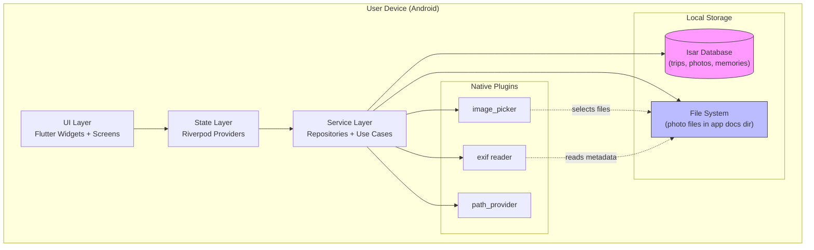
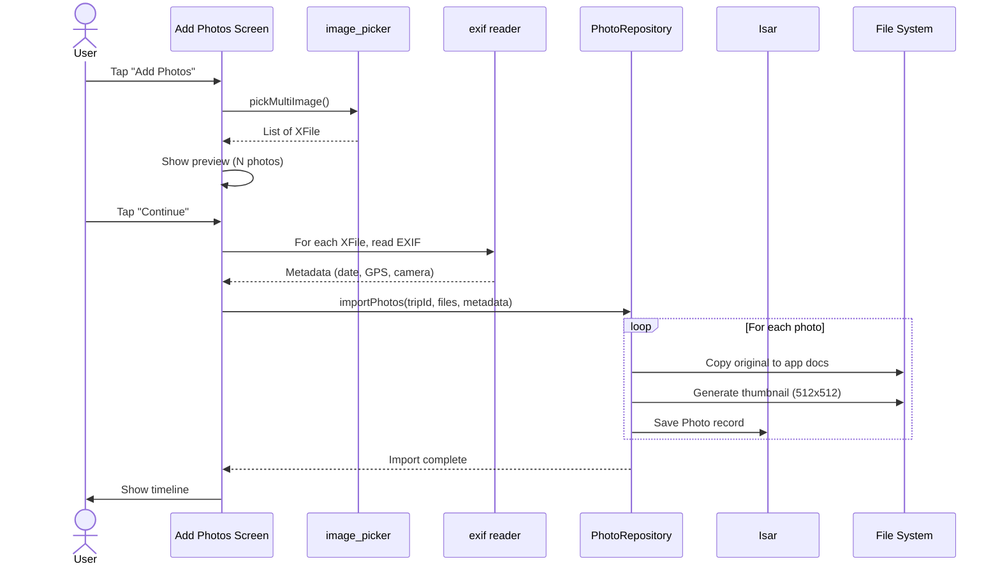
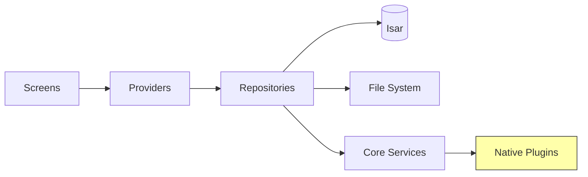

# TAD — Travel Memory Book (Technical Architecture Document)

## 1. System Overview

### 1.1 Purpose
Define technical architecture for **Travel Memory Book**, a Flutter-based offline-first personal travel journaling app.

### 1.2 Scope
- **In scope (MVP)**: Flutter Android app, local storage (Isar + filesystem), photo import, book viewer, journaling.
- **Out of scope (MVP)**: iOS build, cloud sync, AI features, social features.
- **In scope (future)**: iOS, cloud backup, map, calendar, PDF export, AI captions.

### 1.3 PRD Alignment
Implements F1–F13 from PRD (Must + Should features). Aligns with the philosophy: *personal photo book, not social network*.

---

## 2. Architecture Diagram

### 2.1 System Architecture



### 2.2 Data Flow — Adding a Photo



---

## 3. Technology Stack

### 3.1 Frontend

| Component | Technology | Version | Rationale |
|-----------|-----------|---------|-----------|
| Framework | Flutter | 3.24+ stable | Cross-platform, mature |
| Language | Dart | 3.5+ | Null safety, modern |
| State management | flutter_riverpod | 2.5+ | Compile-time safe, testable |
| Navigation | go_router | 14+ | Declarative, deep-link ready |
| Image picker | image_picker | 1.1+ | Official Flutter plugin |
| Image processing | image | 4.3+ | Thumbnail generation |
| EXIF | exif | 3.3+ | Date, GPS, camera metadata |
| Local DB | isar | 3.1+ | NoSQL, fast for our use case |
| Path utilities | path_provider | 2.1+ | App docs directory |
| Date formatting | intl | 0.19+ | i18n dates |
| Fonts | google_fonts | 6.2+ | Easy custom typography |
| Animations | flutter built-in | - | PageView for book flip |

### 3.2 Backend
- **MVP**: None
- **Phase 3**: TBD (Firebase / Supabase / custom)

### 3.3 Database

**Isar 3.1+** (NoSQL, embedded)
- Chosen over SQLite because:
  - Object-oriented, less boilerplate
  - Fast indexed queries for our scale
  - Built-in support for nested objects
  - Reactive queries (useful for auto-updating UI)
- Schema: Trip, Photo, Memory, Location, TravelBook

### 3.4 Infrastructure

- **Local only**: No servers in MVP
- **CI**: GitHub Actions (via devops-pipeline)
- **Storage**: App documents directory
- **Backup** (Phase 3): TBD

### 3.5 DevOps

- **Version control**: Git
- **Pre-commit**: gitleaks (secret detection), flutter analyze
- **CI**: GitHub Actions
- **Distribution**: Google Play Store

---

## 4. System Components

### 4.1 Feature Modules

```
lib/features/
├── home/                # Library view (F1)
│   ├── screens/
│   │   └── home_screen.dart
│   ├── widgets/
│   │   ├── trip_card.dart
│   │   └── empty_state.dart
│   └── providers/
│       └── home_provider.dart
│
├── trips/               # Trip CRUD (F2, F12)
│   ├── screens/
│   │   ├── trip_detail_screen.dart
│   │   ├── trip_form_screen.dart
│   │   └── trip_settings_screen.dart
│   ├── widgets/
│   │   ├── trip_info_card.dart
│   │   └── trip_sort_menu.dart
│   └── providers/
│       └── trip_provider.dart
│
├── photos/              # Photo import, detail, timeline (F3, F4, F8, F11, F13)
│   ├── screens/
│   │   ├── add_photos_screen.dart
│   │   ├── photo_detail_screen.dart
│   │   └── photo_import_progress_screen.dart
│   ├── widgets/
│   │   ├── photo_thumbnail.dart
│   │   ├── photo_grid.dart
│   │   ├── photo_timeline.dart
│   │   └── import_progress_bar.dart
│   └── providers/
│       └── photo_provider.dart
│
├── travel_book/         # Book assembly + viewer (F5, F6)
│   ├── screens/
│   │   └── book_viewer_screen.dart
│   ├── widgets/
│   │   ├── book_cover.dart
│   │   ├── book_page.dart
│   │   └── page_flip_animation.dart
│   └── providers/
│       └── book_provider.dart
│
├── memories/            # Journal (F7)
│   ├── screens/
│   │   └── memory_editor_screen.dart
│   ├── widgets/
│   │   └── memory_card.dart
│   └── providers/
│       └── memory_provider.dart
│
├── profile/             # Personal stats
│   ├── screens/
│   │   └── profile_screen.dart
│   └── providers/
│       └── profile_provider.dart
│
└── settings/            # Theme, about
    ├── screens/
    │   └── settings_screen.dart
    └── providers/
        └── settings_provider.dart
```

### 4.2 Core Infrastructure

```
lib/core/
├── theme/
│   ├── app_theme.dart           # Light + Dark themes
│   ├── app_colors.dart          # Color palette
│   └── app_typography.dart      # Text styles
│
├── router/
│   └── app_router.dart          # go_router config
│
├── constants/
│   └── app_constants.dart       # Keys, defaults
│
├── database/
│   ├── isar_provider.dart       # Isar instance
│   ├── isar_collections.dart    # Collection registration
│   └── migrations.dart          # Schema migrations
│
├── services/
│   ├── exif_service.dart        # EXIF reading
│   ├── image_service.dart       # Thumbnail generation
│   ├── file_service.dart        # File copy/move
│   └── permissions_service.dart # Camera/storage perms
│
├── widgets/                     # Reusable UI components
│   ├── primary_button.dart
│   ├── section_header.dart
│   ├── empty_state.dart
│   └── progress_overlay.dart
│
└── utils/
    ├── date_utils.dart
    ├── file_utils.dart
    └── format_utils.dart
```

### 4.3 Data Layer

```
lib/
├── models/
│   ├── trip.dart
│   ├── photo.dart
│   ├── memory.dart
│   ├── location.dart
│   └── travel_book.dart
│
└── repositories/
    ├── trip_repository.dart
    ├── photo_repository.dart
    ├── memory_repository.dart
    └── book_repository.dart
```

### 4.4 Component Dependencies



---

## 5. Data Architecture

### 5.1 Isar Collections

#### Trip Collection

```dart
@collection
class Trip {
  Id id = Isar.autoIncrement;
  
  @Index()
  late String title;
  
  late String description;
  
  String? coverPhotoPath;
  
  @Index()
  late DateTime startDate;
  
  late DateTime endDate;
  
  late String country;
  late List<String> cities;
  
  @Index()
  late DateTime createdAt;
  
  late DateTime updatedAt;
}
```

#### Photo Collection

```dart
@collection
class Photo {
  Id id = Isar.autoIncrement;
  
  @Index()
  late int tripId;
  
  @Index()
  late String filePath;
  
  late String thumbnailPath;
  
  @Index()
  late DateTime takenAt;
  
  double? latitude;
  double? longitude;
  
  String? locationName;
  String? caption;
  
  @Index()
  late int day; // day number within trip
  
  late int sortOrder;
}
```

#### Memory Collection

```dart
@collection
class Memory {
  Id id = Isar.autoIncrement;
  
  @Index()
  late int tripId;
  
  DateTime? date; // null = whole trip
  String? title;
  
  late String content;
  
  int? locationId;
  
  late DateTime createdAt;
  late DateTime updatedAt;
}
```

#### Location Collection

```dart
@collection
class Location {
  Id id = Isar.autoIncrement;
  
  @Index()
  late int tripId;
  
  late String name;
  double? latitude;
  double? longitude;
  String? description;
}
```

#### TravelBook Collection

```dart
@collection
class TravelBook {
  Id id = Isar.autoIncrement;
  
  @Index(unique: true)
  late int tripId;
  
  String? coverPhoto;
  
  late List<BookPage> pages;
  
  late DateTime createdAt;
  late DateTime updatedAt;
}

@embedded
class BookPage {
  late String type; // 'cover', 'day', 'photo', 'memory'
  late int? dayNumber;
  late int? photoId;
  String? title;
  String? subtitle;
  String? body;
  late int order;
}
```

### 5.2 File Storage Layout

```
<app_docs>/                     # path_provider getApplicationDocumentsDirectory()
├── trips/
│   └── <trip_id>/
│       ├── cover/
│       │   └── cover.jpg
│       ├── photos/
│       │   ├── photo_001.jpg       # Original
│       │   ├── photo_002.jpg
│       │   └── ...
│       └── thumbnails/
│           ├── thumb_001.jpg       # 512x512
│           ├── thumb_002.jpg
│           └── ...
└── isar/
    └── travel_memory_book.isar    # Isar database file
```

### 5.3 Data Flow

**Creating a Trip**:
1. User fills form → Trip object created in memory
2. TripRepository.create(trip) → Isar write
3. User picks cover → ImageService.copyToDocs(cover, tripId/cover/)
4. Update Trip.coverPhotoPath → Isar write

**Adding Photos**:
1. image_picker returns XFile list
2. For each XFile:
   - ExifService.read(file) → metadata
   - ImageService.copyOriginal(file, tripId/photos/) → original path
   - ImageService.generateThumbnail(original, tripId/thumbnails/) → thumb path
   - PhotoRepository.create(Photo(...)) → Isar write
3. Update Trip.updatedAt → Isar write
4. Riverpod invalidates timeline query → UI updates

**Reading a Book**:
1. User taps "Read Book"
2. BookRepository.getByTripId(tripId) → Book object
3. If book doesn't exist: BookRepository.assemble(tripId) → creates from photos
4. BookViewerScreen displays pages in order
5. PageView allows swiping

---

## 6. Infrastructure

### 6.1 Environments

| Env | Purpose | DB | Data |
|-----|---------|----|----|
| Development | Local dev | Isar (local) | Test data |
| Production | End user | Isar (local) | Real user data |

### 6.2 Scaling
- **MVP**: Single device, local storage. No scaling needed.
- **Phase 3**: Cloud sync → multi-device → TBD infra.

### 6.3 Cost Estimates

| Phase | Component | Cost |
|-------|-----------|------|
| MVP | Local storage only | $0/mo |
| MVP | Google Play registration | $25 (one-time) |
| MVP | Flutter SDK | $0 |
| MVP | **Total MVP** | **$25 one-time + $0/mo** |
| Phase 3 | Cloud backup (e.g., Firebase) | ~$5-25/mo per heavy user |
| Phase 3 | Print-on-demand (Lulu, Blurb) | Passed to user |

### 6.4 CI/CD

- **GitHub Actions**: Run on push to main + PRs
  - `flutter analyze`
  - `flutter test`
  - `flutter build apk` (smoke test)
- **Pre-commit**: gitleaks, flutter analyze (via devops-pipeline)

---

## 7. Security

### 7.1 Threat Model
- **Primary threat**: Physical device access (theft, loss)
- **Secondary**: Malicious app on same device
- **Out of scope (MVP)**: Network attacks (no network in MVP)

### 7.2 Data Protection

| Data | Protection |
|------|-----------|
| Photo files | App-private storage (sandboxed) |
| Database | App-private storage |
| EXIF data | Read on device, never sent |
| Backups (Phase 3) | E2E encryption if cloud added |

### 7.3 Permissions

| Permission | Why | How to request |
|------------|-----|----------------|
| Camera | Take photos for trips | Permission_handler |
| Storage/Photos (Android) | Pick from gallery | image_picker handles |
| Location (optional) | Tag photos (Phase 2) | Permission_handler |

### 7.4 Privacy

- Zero analytics in MVP
- No third-party SDKs that phone home
- All data stays on device until user explicitly exports

### 7.5 OWASP Controls
- **M1 (Improper Platform Use)**: Use platform-recommended patterns (image_picker, path_provider)
- **M2 (Insecure Data Storage)**: All data in app-private directory
- **M5 (Insecure Communication)**: N/A in MVP (no network)
- **M8 (Code Tampering)**: Play Store signing (Phase 5)

---

## 8. Performance

### 8.1 Targets

| Metric | Target | Strategy |
|--------|--------|----------|
| App cold start | < 2s | Lazy load providers, minimal main() |
| Photo import | 2s per 10 photos | Use Isolate for image processing |
| Timeline load | < 300ms for 500 photos | Indexed queries, paginate if needed |
| Book page render | < 100ms | Cache thumbnails, lazy load original |
| Page flip animation | 60fps | Use PageView with cached images |
| DB query p95 | < 100ms | Index all query columns |

### 8.2 Optimization Strategies

1. **Thumbnails**: Generate 512x512 thumbs on import, never render full-size in lists
2. **Lazy loading**: Paginate photo grid (50 per page)
3. **Image caching**: Use cached_network_image-equivalent for local files (custom cache)
4. **Background processing**: Use Isolate for:
   - EXIF reading
   - Thumbnail generation
   - File copying
5. **DB indexes**: All query columns indexed
6. **Pagination**: Trip list paginates at 20

### 8.3 Memory Management

- Max 50 thumbnails in memory at once
- Full-size photos only loaded in Photo Detail
- Recycle View patterns via Flutter's built-in lazy builders

---

## 9. Development

### 9.1 Environment Setup

```bash
# Flutter SDK
flutter --version  # 3.24+

# Android SDK
sdkmanager --list_installed  # Android API 34

# Project init
cd $PRODUCT_DIR/app
flutter pub get
flutter pub run build_runner build  # Generate Isar adapters
flutter run
```

### 9.2 Project Structure

```
travel_memory_book/
├── android/                    # Android config
├── ios/                        # iOS (future)
├── lib/                        # Dart source
│   ├── main.dart
│   ├── app.dart
│   ├── core/
│   ├── features/
│   ├── models/
│   └── repositories/
├── test/                       # Unit tests
│   ├── models/
│   ├── repositories/
│   └── features/
├── assets/                     # Images, fonts
│   ├── images/
│   └── fonts/
├── pubspec.yaml
└── README.md
```

### 9.3 Testing Strategy

- **Unit tests**: Models, repositories, services (~70% coverage target)
- **Widget tests**: Key screens (home, book viewer)
- **Integration tests**: E2E flows (create trip, add photos, view book)
- **Manual testing**: UX verification on physical device

### 9.4 Code Quality

- **Linter**: flutter_lints
- **Format**: `dart format` pre-commit
- **Analyze**: `flutter analyze` in CI
- **Type safety**: 100% null-safe

---

## 10. Risks

| Risk | Probability | Impact | Mitigation |
|------|-------------|--------|------------|
| Isar abandoned/buggy | Low | High | Fall back to drift (SQLite) — well-maintained alternative |
| Photo import causes OOM | Med | High | Use Isolate, limit concurrent processing, lazy thumbnails |
| Large books lag | Med | Med | Paginate book, lazy load next page |
| EXIF data missing for many users | High | Low | Allow manual location entry with autocomplete |
| App data loss on uninstall | High | High | Phase 3 cloud backup; show warning in settings |
| Android storage permission changes | Med | Med | Test on latest Android API, use photo_picker (Android 13+) |
| Battery drain from background import | Low | Med | Use foreground service notification for long imports |

---

## 11. Appendix

### 11.1 Key Design Decisions

1. **Isar over SQLite**: Object-oriented fits Flutter models, less boilerplate, reactive queries.
2. **No backend in MVP**: User spec says offline-first, personal use. Avoids server cost + complexity.
3. **Riverpod over Bloc**: Simpler API, less boilerplate, good for personal project scale.
4. **go_router over Navigator 2.0**: Standard, well-documented, future-proof for deep links.
5. **Local file storage**: Originals kept as-is, no re-compression (preserves quality).

### 11.2 Future Considerations

- **Phase 2**: Map (flutter_map + OpenStreetMap), Calendar, Stats
- **Phase 3**: Cloud sync (Supabase or Firebase), AI captions (OpenAI), Print (Lulu API)
- **Multi-platform**: iOS build after MVP stable

### 11.3 Glossary

- **Isar**: NoSQL embedded database for Flutter
- **EXIF**: Exchangeable Image File Format (image metadata)
- **PageView**: Flutter widget for swipeable pages
- **Isolate**: Dart's concurrency primitive (separate thread)
- **Riverpod**: State management library for Flutter

### 11.4 Revision History

| Version | Date | Author | Changes |
|---------|------|--------|---------|
| 1.0 | 2026-08-29 | Lãm | Initial TAD from PRD v1.0 |
